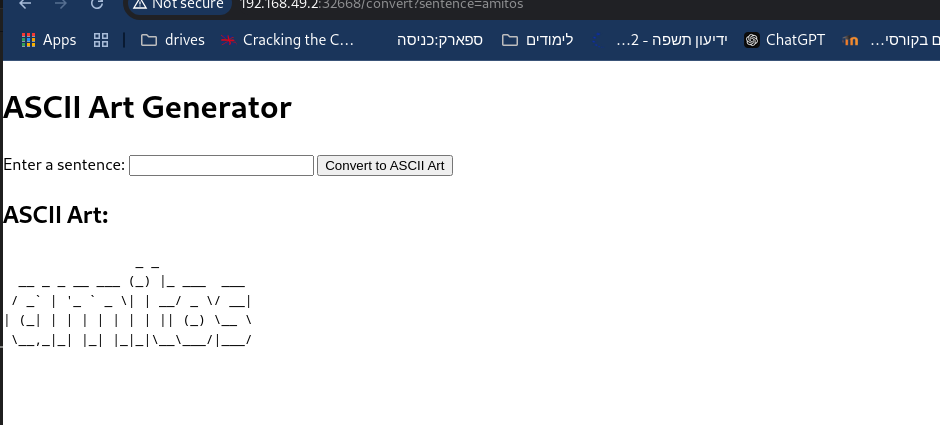

# **Client-Server Application on VMs and Kubernetes**

This project demonstrates deploying a simple client-server application on both virtual machines (VMs) and a Kubernetes cluster. The application converts user input text into ASCII art.

---

## **Architecture Overview**

### **Part 1: Deployment on VMs**
- **Server**:
  - Listens on a specific port and processes client requests.
  - Responds with ASCII art for the provided text.
- **Client**:
  - Sends requests to the server and displays the ASCII art.
- **Setup**:
  - Two VMs running Fedora/RHEL, networked within the same hypervisor.
  - Manual configuration for dependencies and application deployment.

### **Part 2: Deployment on Kubernetes**
- **Server**:
  - Scaled dynamically using Kubernetes deployments.
  - Exposed as a `ClusterIP` service for internal cluster communication.
- **Client**:
  - Configured via a `ConfigMap` to communicate with the server service.
  - Exposed to external users via a `NodePort` service.

---

## **Advantages and Disadvantages**

### **Deployment on VMs**

**Advantages**:
- Simple setup, suitable for basic environments.
- No need for advanced tools like Kubernetes.
- Direct control over system resources and configurations.

**Disadvantages**:
- Manual scaling and monitoring.
- Complex networking setup for inter-VM communication.
- Difficult to manage in large-scale production environments.

---

### **Deployment on Kubernetes**

**Advantages**:
- Automated scaling and self-healing for server pods.
- Simplified networking using DNS-based service discovery.
- Easily integrates with CI/CD pipelines and modern DevOps practices.

**Disadvantages**:
- Requires a Kubernetes cluster setup, which adds complexity.
- Higher learning curve for beginners.

---

## **Steps Followed**

### **Part 1: Deployment on VMs**
1. **VM Setup**:
   - Provisioned two Fedora VMs and ensured they were networked together.
2. **Application Deployment**:
   - Installed necessary dependencies (`figlet`, Python Flask).
   - Deployed the server on one VM and the client on the other.
3. **Verification**:
   - Tested the interaction using hostname-based communication.

### **Part 2: Deployment on Kubernetes**
1. **Containerization**:
   - Created Docker/Podman images for client and server applications.
   - Pushed images to Quay.io.
2. **Kubernetes Cluster**:
   - Set up a Minikube cluster.
3. **Server Deployment**:
   - Created a deployment for the server.
   - Configured the server using a `ConfigMap`.
   - Exposed it as a `ClusterIP` service.
4. **Client Deployment**:
   - Created a deployment for the client.
   - Configured the client using a `ConfigMap`.
   - Exposed the client via a `NodePort` service.
5. **Scaling**:
   - Increased the server replica count and verified load distribution.
6. **Verification**:
   - Used the browser and `curl` to test client-server interaction.

---

## **Deliverables**


### **Configuration Files**
- `Dockerfiles` for client and server.
- Kubernetes manifests:
  - Deployments and services for client and server.
  - ConfigMap for client configuration.

### **Logs and Screenshots**
- Logs demonstrating successful client-server communication for both VM and Kubernetes setups.
- Screenshots of browser-based client interaction and Kubernetes dashboard.



---
## **Deploying Locally**

To deploy the application locally on your Kubernetes cluster, follow these steps:

1. Navigate to the `manifests` directory:
    ```bash
    cd manifests
    ```
2. Apply the Kubernetes manifests:
    ```bash
    kubectl apply -f manifests/config-map.yaml
    kubectl apply -f manifests/client-deployment.yaml 
    kubectl apply -f manifests/server-deployment.yaml  
    ```
3. To view the ip of your application:
    ```bash
    kubectl get nodes -o wide
    ```
    * Locate the EXTERNAL-IP column in the output.
4. Access the client in your browser::
    ```
    http://<EXTERNAL IP>:30001
    ```

## **Testing Locally**
You can verify the application using a test job:
1. Apply the test job manifest:
    ```bash
    kubectl apply -f manifests/test-job.yaml
    ```
2. List all pods to find the test job pod name:
    ```bash
    kubectl get pods
    ```
    * Look for a pod with the name test-job-<random-string>.
3. Check the logs of the test job pod:
    ```bash
    kubectl logs test-job-<random-string>
    ```
    * Replace <random-string> with the actual suffix of the test job pod.
4. The logs will indicate whether the test passed.


---

## **Summary**

This exercise highlights the evolution from VM-based application deployment to a scalable and modern Kubernetes-based setup. While VMs provide simplicity for smaller use cases, Kubernetes excels in scalability, automation, and production-readiness.
